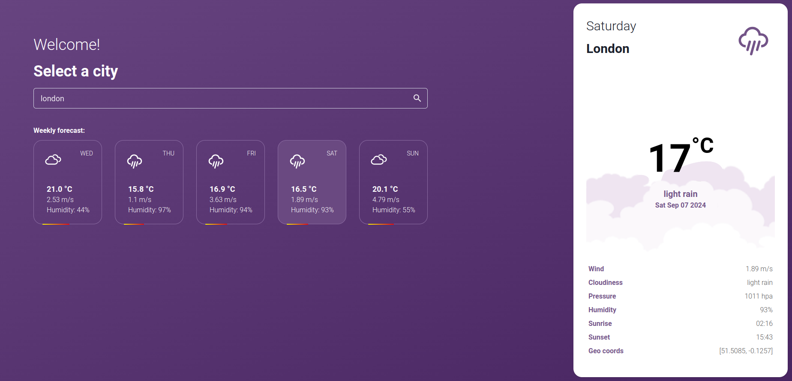

# Weather Forecast

This project is a simple interface for the Open Weather API (more info at https://openweathermap.org/forecast5). It retrives the forecast for the next five days, displaying the expected weather condition at 12pm (noon).

The back-end is implemented in Python using FastAPI, while the front-end is implemented in React TypeScript using Chakra UI.

The video below shows the working system:

[](./media/linx-showcase.mp4)

>NOTE: due to the size of the file, GitHub might not display it, so you can click on it and then select "View raw", which will download the video.

## Running
Everything is containerized, so it should be as easy as going to each folder and running docker-compose.

The following is valid for Linux. If you are running on a different OS or don't have a dependency installed (e.g. Docker, Docker-Compose, Git...), please look for specific instructions for your setup.

### Back-End
To start the containers:
```
cd backend
sudo docker-compose up -d
```

Then it should start the server on ```http://localhost:8000```. You can access the docs on ```http://localhost:8000/docs```.

#### GET /forecast/\<city:string>
This GET endpoint is responsible for retrieving data from the Open Weather API when required. The values are stored on a local table, so if a search is made twice, it will send the stored values. The cached values have a expiration time of one day.

Response:
```
[
  {
    "city": "string",
    "forecast_date": "string",
    "temperature": 0,
    "wind": 0,
    "cloudiness": "string",
    "pressure": 0,
    "humidity": 0,
    "sunrise": 0,
    "sunset": 0,
    "latitude": 0,
    "longitude": 0
  },
]
```


#### GET /history
Returns the search history ordered from the newest to the oldest.

Params:
- limit: integer for limiting the result length;
- search: string containing the search made;
- city: string containing the actual city name retrieved, as it might be different from the search;

Response:
```
[
  {
    "city": "string",
    "search": "string",
    "date": "string"
  },
]
```

### Front-End
To start the container:
```
cd ../frontend
sudo docker-compose up -d
```

Then it should start the application on ```http://localhost:3000```. You can access it from your browser to see the interface.
